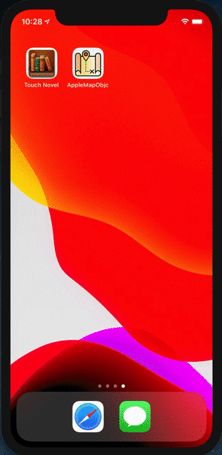
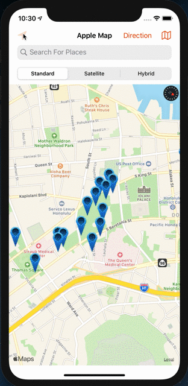
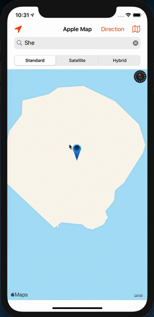
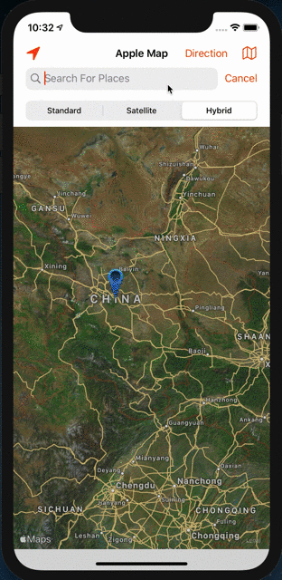
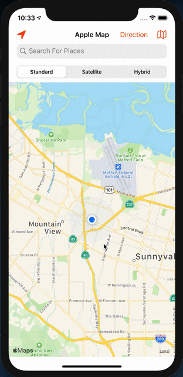
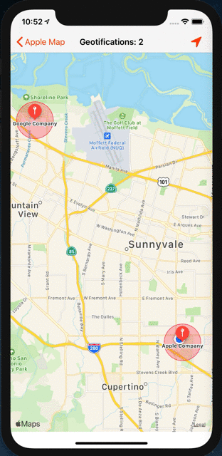
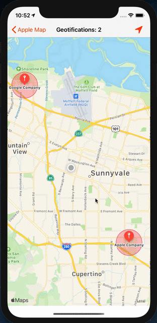

# AppleMapObjC
implement Apple map by using Objective C language.

App Demo: https://drive.google.com/file/d/1DRH7T9CwBMqsu6vyiq0u_jxD0eIQ4PtW/view?usp=sharing
                   https://drive.google.com/file/d/1wcrDewvcqKrIf5lFxGqcexxxeVTG5MVz/view?usp=sharing

        

Code update: Aug 10 

    1. Apple map
    2. objective c, 
    3. GCD, 
    4. completion handler, 
    5. protocol, 
    6. category, 
    7. CLLocation,
    8. searchController, 
    9. mapkit, 
    10.Custom annotaion, 
    11.custom annotation view,
    12.custom callout view. 
    13.geo coder, 
    14.parsing JSON, 
    15.xib, 
    16.Singleton, 
    17.MVVM,
    18.web service
    19.long press gesture
    20.Notification
    21.Region Monitoring
    22.etc, a bunch of things
        
Future Work

    1. Add route direction
    2. Add more different custom Callout View
    3. Fix some bugs.
